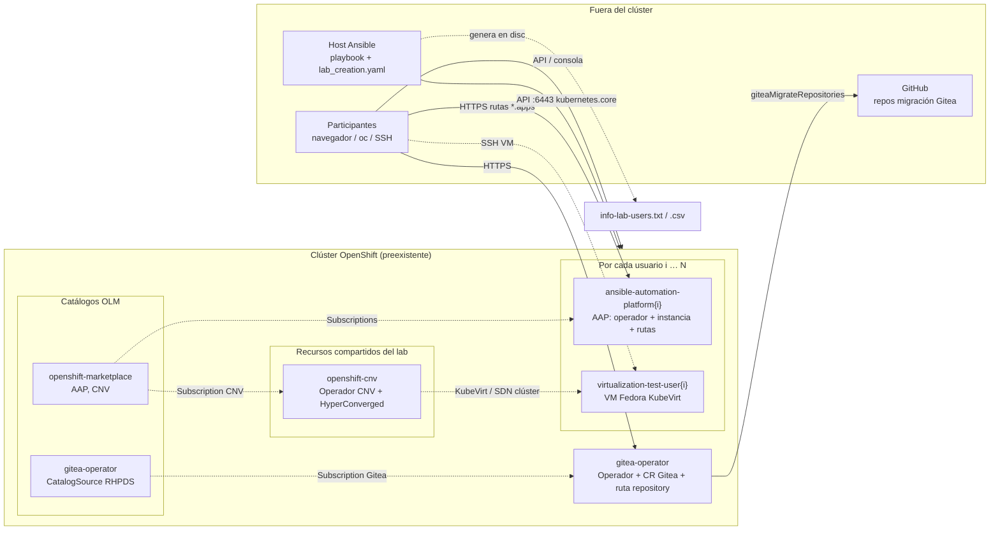
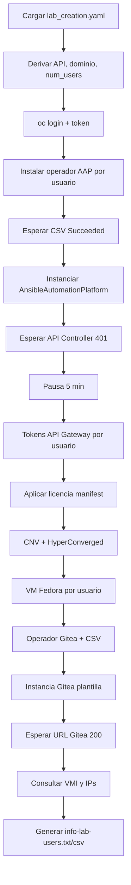

# lab-aap-ansible

Repositorio de Ansible para el aprovisionamiento inicial del laboratorio **Ansible Automation Platform (AAP)** sobre un clúster OpenShift ya provisionado (por ejemplo vía catálogo Babylon / `ResourceClaim`). El flujo principal está en `playbook-install-initial.yaml`.

## Objetivo

Instalar y dejar operativos, por usuario de laboratorio:

- **Operador e instancia de AAP** (canal `stable-2.6`, un namespace `ansible-automation-platform{N}` por usuario).
- **Licencia AAP** mediante manifiesto.
- **OpenShift Virtualization (CNV)** y **HyperConverged**.
- **Máquinas virtuales Fedora** por usuario, con namespaces `virtualization-test-user{N}`.
- **Operador Gitea e instancia** con usuarios y repositorios de ejemplo.
- **Ficheros de resumen** para participantes (`info-lab-users.txt` y `.csv`).

## Requisitos previos

- **OpenShift**: `oc` instalado y accesible desde el host donde se ejecuta Ansible.
- **Ansible** con colecciones:
  - `kubernetes.core` (módulos `k8s`, `k8s_info`).
  - `ansible.controller` (módulo `license` para cargar el manifiesto).
- **Variable de entorno / inventario**: el playbook carga `../lab_creation.yaml` (respecto a esta carpeta), es decir `lab_correos/lab_creation.yaml` en el árbol típico del workspace. Ese fichero debe contener el estado del `ResourceClaim` con `status.summary.provision_data` (API, consola, contraseña admin, lista de usuarios, etc.).
- **Manifiesto de licencia AAP**: ruta relativa usada en el playbook: `../../../manifest_AAP2.6_20260303T154318Z.zip` (desde el directorio del playbook). Ajusta el nombre o sitúa el ZIP según tu despliegue.

## Variables relevantes (desde `lab_creation.yaml`)

El playbook deriva:

| Concepto | Origen |
|----------|--------|
| API del clúster | `status.summary.provision_data.openshift_api_url` |
| Consola | `status.summary.provision_data.openshift_cluster_console_url` |
| Contraseña admin OpenShift | `status.summary.provision_data.openshift_cluster_admin_password` |
| Usuarios del lab | `status.summary.provision_data.users` |
| Dominio del clúster | Extraído de la API con regex `api.<dominio>:6443` → `cluster_domain` |
| Número de usuarios | `users \| length` → `num_users` |

Credenciales AAP usadas para token y licencia (fijas en el playbook): usuario `admin`, contraseña `admin` (secreto Kubernetes en la plantilla de instancia).

## Ficheros del repositorio (resumen)

| Fichero | Uso |
|---------|-----|
| `playbook-install-initial.yaml` | Orquestación principal. |
| `automation-platform-install-operator.yaml.j2` | Namespaces, OperatorGroup y Subscription AAP por usuario (`stable-2.6`). |
| `automation-platform-install-ansible-automation-platform.yaml.j2` | CR `AnsibleAutomationPlatform` y secreto admin por usuario. |
| `automation-platform-install-operator.yaml` / `automation-platform-install-ansible-automation-platform.yaml` | Manifiestos estáticos de referencia (el playbook usa las plantillas `.j2`). |
| `openshift-virtualization.yaml` | Suscripción/operador CNV (`openshift-cnv`). |
| `openshift-virtualization-hyper-converged.yaml` | CR HyperConverged. |
| `openshift-virtualization-machine-fedora.yaml.j2` | VM Fedora, namespace, RoleBinding y secreto SSH por usuario. |
| `gitea.yaml` | Operador Gitea (`gitea-operator`). |
| `gitea-instance.yaml.j2` | CR `Gitea`: usuarios `lab-user-%d`, repos migrados desde GitHub (ejercicio AAP). |
| `info-lab-users.txt.j2`, `info-lab-users.csv.j2` | Salida consolidada para el laboratorio. |
| `ssh_tests_connections/` | Claves de prueba referenciadas en plantillas (contexto SSH). |

## Topología: qué se crea, dónde y cómo se relaciona

El laboratorio parte de un **clúster OpenShift ya existente** (por ejemplo aprovisionado con Babylon / `ResourceClaim`). Este repositorio no crea el clúster: instala operadores, CR e instancias **dentro** del clúster y genera ficheros de resumen en el **host donde ejecutas Ansible** (`localhost`).

```mermaid
flowchart TB
  subgraph Control["Host de control (donde corre Ansible)"]
    PB[playbook-install-initial.yaml]
    LC[lab_creation.yaml]
    OUT[info-lab-users.txt / .csv]
    LC -->|vars_files| PB
    PB --> OUT
  end

  subgraph Ext["Servicios externos"]
    GH[GitHub repos de migración a Gitea]
    RHOPS[Catálogo redhat-operators<br/>openshift-marketplace]
    RHPDS[Catálogo RHPDS Gitea<br/>quay.io/rhpds/gitea-catalog]
  end

  subgraph OCP["Clúster OpenShift (preexistente)"]
    API[API :6443 / Ingress *.apps.cluster_domain]

    subgraph PerUser["Por cada usuario i = 1 … N"]
      subgraph NS_AAP["Namespace ansible-automation-platform{i}"]
        AAP_OP[AAP Operator stable-2.6]
        AAP_CR[AnsibleAutomationPlatform + secreto admin]
        AAP_RT["Ruta HTTPS<br/>example{i}-ansible-automation-platform{i}.apps…"]
        AAP_OP --> AAP_CR --> AAP_RT
      end
      subgraph NS_VM["Namespace virtualization-test-user{i}"]
        RB[RoleBinding admin → user{i}]
        VM[VirtualMachine Fedora KubeVirt]
        RB --- VM
      end
    end

    subgraph NS_CNV["Namespace openshift-cnv"]
      CNV_OP[Operador kubevirt-hyperconverged]
      HC[CR HyperConverged]
      CNV_OP --> HC
    end

    subgraph NS_GIT["Namespace gitea-operator"]
      CS[CatalogSource redhat-rhpds-gitea]
      G_OP[Gitea Operator]
      G_CR[CR Gitea repository]
      G_RT["Ruta HTTPS<br/>repository-gitea-operator.apps…"]
      CS --> G_OP --> G_CR --> G_RT
    end

    HC -.KubeVirt / redes del clúster.-> VM
  end

  PB -->|oc login + API kubernetes.core| API
  RHOPS -.Subscription AAP.-> AAP_OP
  RHOPS -.Subscription CNV.-> CNV_OP
  RHPDS -.CatalogSource + Subscription.-> CS
  G_CR -->|giteaMigrateRepositories| GH

  subgraph Participants["Participantes (navegador / CLI)"]
    U[user1 … userN + admin]
  end
  U --> API
  U --> AAP_RT
  U --> G_RT
  U -.SSH.-> VM

  NOTE["Dev Spaces: URL devspaces.apps…<br/>solo referenciada en la salida;<br/>no la instala este playbook."]
  PB -.set_fact.-> NOTE
```

### Topología de despliegue y conexiones (vista resumida)

El siguiente diagrama resume **dónde vive cada recurso** en el clúster (namespaces) y **quién se conecta con qué**; encaja con el flujo detallado de arriba.



**Lectura rápida**

| Ámbito | Dónde vive | Qué aporta este playbook |
|--------|------------|---------------------------|
| AAP | Un namespace `ansible-automation-platform{N}` por usuario | Operador, instancia, licencia por manifiesto; rutas al Controller/API Gateway. |
| Virtualización | `openshift-cnv` (clúster) + `virtualization-test-user{N}` (por usuario) | CNV + HyperConverged compartidos; una VM Fedora por usuario con `RoleBinding` a `user{N}`. |
| Gitea | `gitea-operator` | Operador desde catálogo RHPDS, instancia `repository`, usuarios `lab-user-%d` y repos migrados desde GitHub. |
| Catálogos OLM | `openshift-marketplace` (AAP, CNV) y `gitea-operator` (CatalogSource propio) | Origen de las `Subscription`; no son recursos “de aplicación” del lab en sí. |
| Salida | Máquina de Ansible | `info-lab-users.*` con API, consola, Gitea, Dev Spaces (URL calculada), AAP y datos de VM cuando KubeVirt ya expone interfaces. |

La URL de **Dev Spaces** se calcula en el playbook para los ficheros de resumen; su despliegue no forma parte de `playbook-install-initial.yaml` (suele existir u obtenerse por otro flujo en el mismo dominio `apps.<cluster_domain>`).

## Flujo del playbook (`playbook-install-initial.yaml`)



## Ejecución

Desde el directorio del repositorio (o indicando ruta al playbook), con el fichero `lab_creation.yaml` colocado un nivel por encima:

```bash
cd /ruta/a/lab-aap-ansible
ansible-playbook playbook-install-initial.yaml
```

También es coherente ejecutarlo desde **AAP/AWX** si el proyecto incluye este repo y el extra-vars o fichero `lab_creation.yaml` equivalente.

## Salidas generadas

En la máquina de control (localhost), según el playbook:

- `~/Correos/lab_correos/info-lab-users.txt`
- `~/Correos/lab_correos/info-lab-users.csv`

Incluyen URLs (API, consola, Gitea, Dev Spaces calculado), credenciales por usuario de OpenShift y líneas con nombre/IP de la VM Fedora cuando la consulta a KubeVirt tiene datos.

## Notas operativas

- Las esperas (`until` + `retries`) dependen de tiempos de instalación del clúster; en clústeres lentos puede ser necesario aumentar reintentos.
- La URL de AAP por usuario sigue el patrón `example{N}-ansible-automation-platform{N}.apps.<cluster_domain>`.
- El comentario inicial del YAML del playbook menciona webhook/repositorio; el contenido actual del fichero es instalación en OpenShift.
